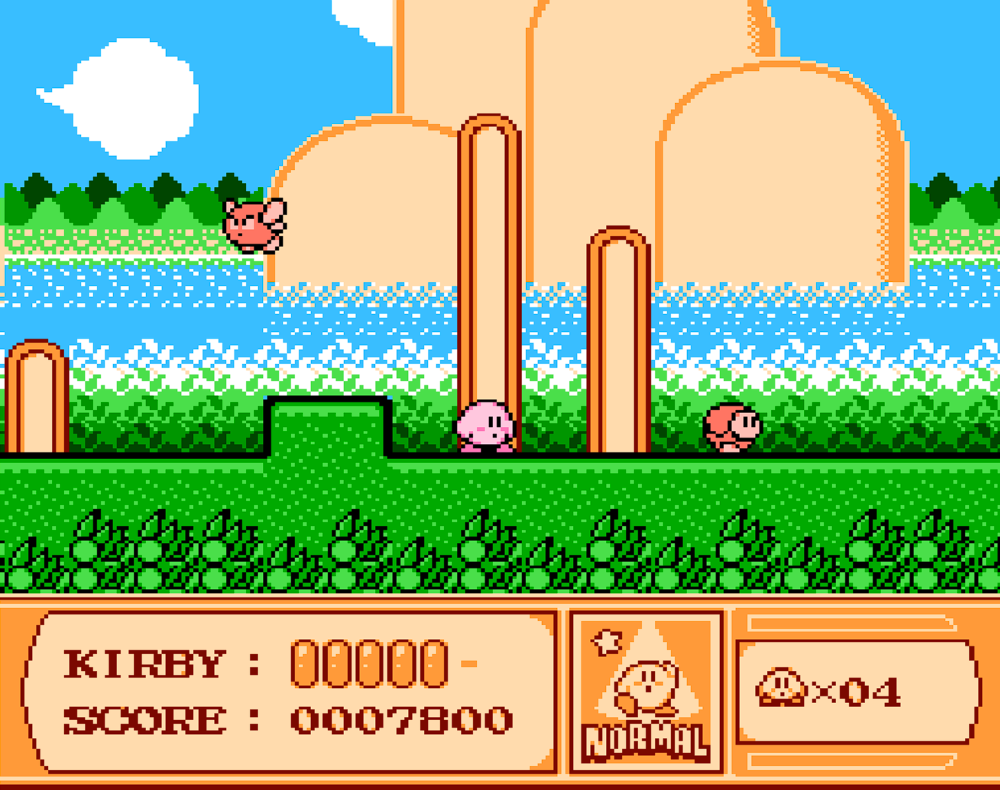
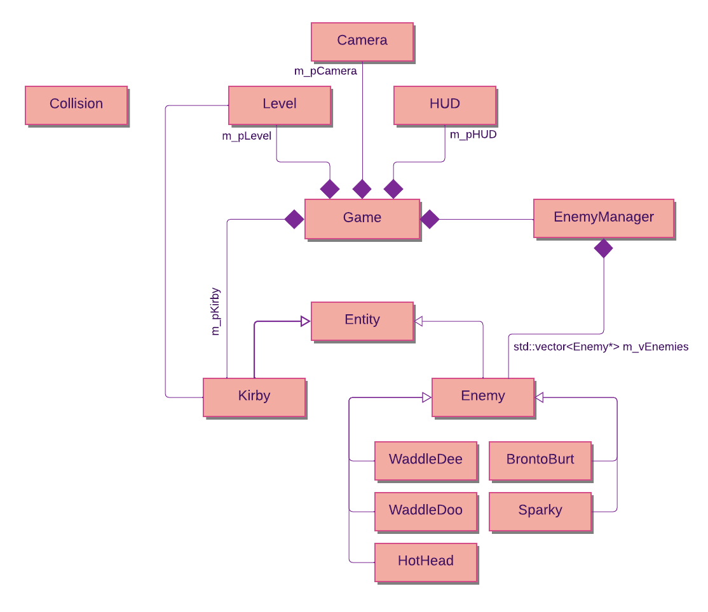
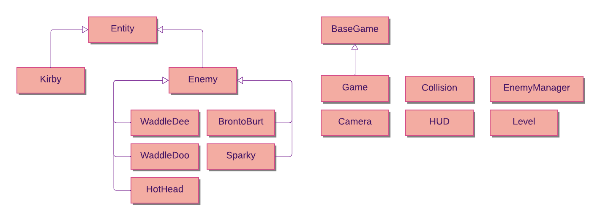

<!-- GENERAL GAME INFO -->
 

  <h1 align="center">KIRBY'S ADVENTURE</h1>

  

    Kirby's Adventure is a side-scrolling platform game developed in 1993 for the NES. The game has a wide variety of enemies with special abilities. When inhaling and swallowing an enemy as Kirby, you can take over their special powers. Kirby on his own also has some special moves. He can walk, sprint, jump, fly, inhale, slide, and more.     
    <strong>Original game : </strong>
    <a href="https://en.wikipedia.org/wiki/Kirby%27s_Adventure"><strong>General info »</strong></a>
    ·
    <a href="https://www.youtube.com/watch?v=_WsaJLcBQCY/$"><strong>Youtube video »<strong></a>
     
     
  

<!-- TABLE OF CONTENTS -->

  
Table of Contents

  <ol>
    <li>
      <a href="#about-the-project">About The Project</a>
    </li>
    <li>
      <a href="#my-version">My version</a>
    </li>
    <li>
      <a href="#getting-started">Getting Started</a>
    </li>
    <li><a href="#how-to-play">How To Play</a></li>
    <li><a href="#class-structure">Class structure</a></li>
    <li><a href="#checklist">Checklist</a></li>
    <li><a href="#contact">Contact</a></li>
    <li><a href="#acknowledgments">Acknowledgments</a></li>
  </ol>

<!-- ABOUT THE PROJECT -->
## About The Project

Here's why:
* "Kirby's Adventure" is an easy to understand and fun to play game, that's why it was one of the first games that I thought of when choosing a game.
* Kirby's cute and friendly looking appearance makes  him one of my favorite Nintendo characters.
* One of my best friends is the biggest Kirby fan I know, so I couldn't not choose a Kirby game.

(<a href="#readme-top">back to top</a>)

## My version

This section gives a clear and detailed overview of which parts of the original game I planned to make.

### The minimum I will most certainly develop:
* Kirby's basic mechanics
* The first level of the game
* Different types of enemies, as found in level 1
* Power-Ups for Kirby

### What I will probably make as well:
* Particle effects for all the different actions in the game
* Loading screens and menus
* The level-hub as seen in the original game

### What I plan to create if I have enough time left:
* The jump pad mini game, accessed when completing a level, used to gain bonus score or extra lives
* More levels
* More enemies and power-ups for Kirby
* The small 'boss-fight' found in level 2

(<a href="#readme-top">back to top</a>)

<!-- GETTING STARTED -->
## Getting Started
Detailed instructions on how to run your game project are in this section.

### Prerequisites

<!--This is an example of how to list things you need to use the software and how to install them. -->
* Visual Studio 2022

### How to run the project

* Please use the latest, most up-to-date version of the project for an optimal experience

(<a href="#readme-top">back to top</a>)

<!-- HOW TO PLAY -->
## How to play

Use this space to show useful examples of how a game can be played. 
Additional screenshots and demos work well in this space. 

### Controls

#### &nbsp;&nbsp;Movement
* LEFT ARROW &nbsp;&nbsp;&nbsp;&nbsp;&nbsp;: &nbsp;move left
* RIGHT ARROW &nbsp;&nbsp;: &nbsp;move right
* SPACE &nbsp;&nbsp;&nbsp;&nbsp;&nbsp;&nbsp;&nbsp;&nbsp;&nbsp;&nbsp;&nbsp;&nbsp;&nbsp;&nbsp;&nbsp;&nbsp;: &nbsp;jump
* UP ARROW &nbsp;&nbsp;&nbsp;&nbsp;&nbsp;&nbsp;&nbsp;&nbsp;: &nbsp;fly
#### &nbsp;&nbsp;Abilities
* L_SHIFT &nbsp;&nbsp;&nbsp;&nbsp;&nbsp;&nbsp;&nbsp;&nbsp;&nbsp;&nbsp;&nbsp;&nbsp;&nbsp;&nbsp;&nbsp;&nbsp;&nbsp;&nbsp;&nbsp;&nbsp;&nbsp;&nbsp;&nbsp;&nbsp;&nbsp;&nbsp;&nbsp;&nbsp;&nbsp; : &nbsp;inhale/exhale/use ability
* DOWN ARROW &nbsp;&nbsp;&nbsp;&nbsp;&nbsp;&nbsp;&nbsp;&nbsp;&nbsp;&nbsp;&nbsp;&nbsp;&nbsp;&nbsp;&nbsp;&nbsp;&nbsp;: &nbsp;duck/swallow
* SPACE + DOWN ARROW &nbsp;&nbsp;: &nbsp;slide

note: ability and swallow have not yet been implemented

### Utilities
Upon contact with an enemy, the player gains a few seconds of invincibility.
You can press the "R" key to reset the game.
Upon losing all Health and Lives, the game will automatically reset.

(<a href="#readme-top">back to top</a>)

<!-- CLASS STRUCTURE -->
## Class structure 

### Overview 
>This is an overview of the different class relationships used in my project.
>
>

### Inheritance
>I created an overarching Entity class which all types of entities inherit from. This class has member functions such as Draw, Update, ApplyGravity and more that apply to all entities. Member variables include m_pTexture, m_Position, m_Hitbox, m_Velocity and other variables that all entities must have.
>Since the game has different types of enemies, each with different functionality, I made a class for each type. Each type then inherits from the Enemy class (which in turn inherits from the Entity class), which includes functionality shared across all Enemy types.
>
>Example:
>Both Kirby (the player) and the enemies should abide by the laws of gravity, hence why the ApplyGravity function is part of the Entity class. But only Kirby can be controlled by user-input, thus this functionality is part of the Kirby class. Furthermore, each Enemy can interact with Kirby, but only Hot Head can shoot fire. Therefore those functionalities are placed in the Enemy and HotHead class respectively.
>
>

<!-- ### .. -->

(<a href="#readme-top">back to top</a>)

<!-- CHECKLIST -->
## Checklist

- [x] Accept / set up github project
- [x] week 01 topics applied
    - [x] const keyword applied proactively (variables, functions,..)
    - [x] static keyword applied proactively (class variables, static functions,..)
    - [x] object composition (optional)
- [x] week 02 topics applied
- [x] week 03 topics applied
- [x] week 04 topics applied
- [x] week 05 topics applied
- [x] week 06 topics applied
- [ ] week 07 topics applied
- [ ] week 08 topics applied
- [ ] week 09 topics applied (optional)
- [ ] week 10 topics applied (optional)

(<a href="#readme-top">back to top</a>)

<!-- CONTACT -->
## Contact

Kobe Dereyne - kobe.dereyne@student.howest.be

Project Link: [https://github.com/your_username/repo_name](https://github.com/your_username/repo_name)

(<a href="#readme-top">back to top</a>)

<!-- ACKNOWLEDGMENTS -->
## Acknowledgments

Use this space to list resources you find helpful and would like to give credit to. 

<!--* [Example 1: cpp reference on std::vector](https://en.cppreference.com/w/cpp/container/vector) -->
* ..

(<a href="#readme-top">back to top</a>)

